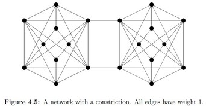

# Foundation of Data Science
- Chapter 4 : Random Walks and Markov Chaina
  - 4.3 : Areas and Volumes (p.87-89)
  - 4.4 : Convergence of Random Walks on Undirected Graphs (p.89-98)

---

## 進め方の提案
- **4.3 の主張はやや唐突なので、一旦スキップします。**
  - 4.3 がうまくいく理由が 4.4. に書いてあるからです。
  - ただし 4.4 の大事な内容(Thoerem 4.5)は証明がちょっと難しいです。
- そのため、次の進め方とします。
  - まず証明をスキップして、4.4 の概要を説明します。
  - この結果を踏まえて 4.3. に戻って内容を説明します。
  - その後で 4.4. の内容(特に証明)を説明します。

---

---

## 4.4. Convergence of Random Walks 
- Undirected Graph 上の Random Walks を考える
- vertex $i, j$ 間に、weight $w_{ij}$ が定義されているとする。
  - undirected なので $w_{ij} = w_{ji}$
- transition probability として次を使うことができる
$$
p_{ij} = \frac{w_{ij}}{\sum_j w_{ij}}
$$
  - 次の記号も定義しておく
    - $w_i = \sum_j w_{ij}$ 
    - $w_{\textrm{total}} = \sum_j w_j$

---

## Random Walks on Undirected graph
- このように定義された $p_{i,j}$ は次の性質を持つ
  - (1) stationary distribution : $\pi_x = w_x / w_{\textrm{total}}$
  - (2) detailed balance : $w_x p_{xy} = w_y p_{yx}$
    - なので $p_{xy}$ で遷移させると $\boldsymbol{\pi}$ に収束する
- 証明 (1) : stationary であることの証明
$$
\begin{align}
\sum_x \pi_x p_{xy}
  &= \sum_x \frac{w_x}{w_{\textrm{total}}} \frac{w_{xy}}{w_x} \\\\
  &= \sum_x \frac{w_{xy}}{w_{\textrm{total}}}
  = \frac{w_y}{w_{\textrm{total}}} = \pi_y
\end{align}
$$
- 証明 (2)
$$
\begin{align}
w_x p_{xy}
  &= w_x \frac{w_{xy}}{w_x} = w_{xy} = w_{yx} \\\\
  &= w_y \frac{w_{yx}}{w_y} = w_y p_{yx}
\end{align}
$$

---

## Undirected Graph の例

- ボトルネック(constriction=狭窄部)が存在する
- このようなケースでは Random Walkがうまく「混じらない」と考えられる

---

## Undirected Graph の例
- Lattice
  - すべてのLatticeの隣り合うLatticeにweight1でつながっている場合
  - 実は section 4.3 ではこの場合が念頭にある。
- Crique
  - 状態遷移でうまく混じるかどうかを定量化したい！

---

## Random Walk の「所要時間」
- 様々な定義が存在する。
  - ある状態に到達する時間 : 4.6で説明
    - ある状態からある状態に遷移する時間 : hitting time
    - すべての状態に到達する時間 : cover time
  - 経験分布が定常分布に近づく時間
    - $\varepsilon$-mixing time : 4.4で説明

---
## mixing time
- Recap : **running average distribution**
$$
\boldsymbol{a}(t) = \frac{1}{t}(
  \boldsymbol{p}(0) +
  \boldsymbol{p}(1) + ... +
  \boldsymbol{p}(t)
)
$$
- $\varepsilon$-mixing time of Markov Chain (Definition 4.1)
  - *minimum integer $t$ such that*
    *for any starting distribution* $\boldsymbol{p}(0)$, 
$$
|\boldsymbol{a}(t) - \boldsymbol{\pi}| \le \varepsilon
$$

---
## Normalized conductance
- あるMarkov Chainが、すべてのノードに対して伝わりやすいかの指標
  - コンダクタンス(conductance)は、もともと電気回路の用語
    - condactance is the inverse of resistance
- まず vertex の subset $S$ に対する定義から考える (Definition 4.2)
  - $\pi(S) = \sum_{x \in S} \pi_x$
  - *The normalized conductance $\Phi(S)$ of $S$ is*
$$
  \Phi(S) = \frac
  {\displaystyle\sum_{(x,y) \in (S, \bar{S})} \pi_x p_{xy}}
  {\min (\pi(S), \pi(\bar{S}))}
$$

---
## Monte Carlo による体積の推定

- 例えば、2次元の乱数を生成することで円の面積を推定できる
  - 1x1の正方形(square)上で一様な乱数(uniform random number)を生成
  - 原点からの距離が1以下になる場合の割合を算出する。
    - この値が1/4の円の面積 $\pi / 4$ に近づく

- ただしこれが$d$次元($d$はとても大きい)ではどうなるのだろう？
  - この値は、$d!$のオーダーで小さくなる。acceptance ratio がとても小さい。
- そのため、高次元では Monte Carlo は破綻しそうな気がする。
  - でも、MCMCで対象からサンプルすることにより、求める体積の計算精度に対して
    $d$の多項式の計算オーダーで抑えることができると主張している。
    - なぜ？ -> その答えは実は Section 4.4. に書いてある。
