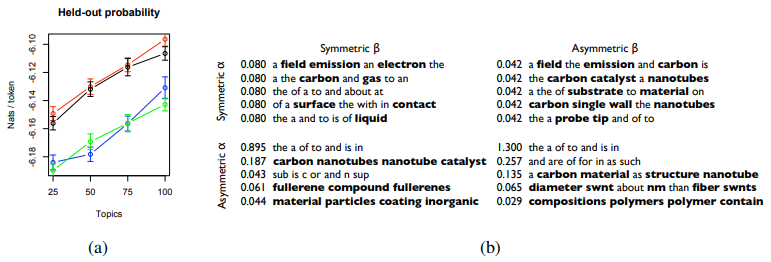

# LDAを極める会
## 2020/03/13
### LDA学習におけるハイパーパラメータ更新式について
---
## ここまでのおさらい
- LDAとは
  - トピックごとに単語分布が決まる
    $\boldsymbol{\phi}_k \sim \textrm{Dirichlet}(\beta)$
  - 文書ごとにトピック分布が決まる
    $\boldsymbol{\theta}_d \sim \textrm{Dirichlet}(\alpha)$
    - 単語ごとにトピックが抽出される
      $z_{dn} \sim \textrm{Multinomial}(\boldsymbol{\theta}_d)$
    - トピックから単語が抽出される
      $w_{dn} \sim \textrm{Multinomial}(\phi_{z_{dn}})$
- Collapsed Gibbs Sampling とは
  - 単語分布、トピック分布を積分消去することで、  
    各単語のトピック$\boldsymbol{z}_d$をGibbs Samplingでサンプル
  - サンプリングした$\boldsymbol{z}_d$ から
    $\boldsymbol{\phi}_k, \boldsymbol{\theta}_d$ を求める

---
## ハイパーパラメータ
- LDAで求めるのは $\boldsymbol{z}$ と $\boldsymbol{\phi}_k, \boldsymbol{\theta}_d$
  - 通常は、$\alpha, \beta$ はすべてのトピック・単語で一様
  - 初期値を適当に決めてしまって、計算させることが多い。
    - `sklearn` のLDAではデフォルト $1/K$

- 単語頻度も、トピック分布も偏りがある
  - $\alpha, \beta$ は、非一様(non-uniform)にすれば精度上がる？
  - 初期値を適当に決めても、適切な値にアップデートできないか？

---
## 今回の話の主題と参考資料
1. 最尤推定により非一様なハイパーパラメータ更新式が得られる
  - Minka TP (2000) のメモ : オリジナルの導出
    https://tminka.github.io/papers/dirichlet/minka-dirichlet.pdf
  - Wallach H の講義ノート  
    https://people.cs.umass.edu/~cxl/cs691bm/lec09.html

2. 非一様なハイパーパラメータを採用すれば精度が上がる。
  - Wallach H+(2009) Rethinking LDA: Why Priors Matter, NIPS2009
    https://papers.nips.cc/paper/3854-rethinking-lda-why-priors-matter.pdf

---
## 前提
- CGSでまず $\boldsymbol{z}_d$ が求まったとする。
- そのあとで $\boldsymbol{z}_d$ を Fix して、
  尤度最大となる $\boldsymbol{\alpha}, \boldsymbol{\beta}$ を求める

---
## ハイパーパラメータの最尤推定 (1/2)
- トピック分布のハイパーパラメータ $\boldsymbol{\alpha}$ について考える。
  - $\boldsymbol{\beta}$ も考え方は同じ

- CGSで発生させた $\boldsymbol{z}$ から次の尤度を最大化する$\boldsymbol{\alpha}$ を求める。
  - $\boldsymbol{\theta}_d$を積分消去する。
$$
P(\boldsymbol{z}|\boldsymbol{\alpha}) =
  \prod_d \int d \boldsymbol{\theta}_d
    P(\boldsymbol{z}_d | \boldsymbol{\theta}_d)
    P(\boldsymbol{\theta}_d | \boldsymbol{\alpha})
$$
  - $P(\boldsymbol{z}_d | \boldsymbol{\theta}_d)$は 多項分布 :
    $\displaystyle
    P(\boldsymbol{z}_d | \boldsymbol{\theta}_d) = \prod_k \theta_k^{N_d {}_k}$
  - $P(\boldsymbol{\theta}_d | \boldsymbol{\alpha})$ はディリクレ分布 : 
    $\displaystyle
    P(\boldsymbol{\theta}_d | \boldsymbol{\alpha})
    = \frac{\Gamma(\sum_k \alpha_k)}{\prod_k \Gamma(\alpha_k)}
      \prod_k \theta_k^{\alpha_k - 1}$

---
## ハイパーパラメータの最尤推定 (2/2)
- これらを代入すると、
$$
\begin{align}
P(\boldsymbol{z}|\boldsymbol{\alpha}) =&
\prod_d \int d \boldsymbol{\theta}_d
\prod_k \theta_k^{N_d {}_k} \cdot
  \frac{\Gamma(\sum_k \alpha_k)}{\prod_k \Gamma(\alpha_k)}
  \prod_k \theta_k^{\alpha_k - 1} \\\\
=&
\prod_d
\frac
  {\Gamma(\sum_k \alpha_k)}
  {\prod_k \Gamma(\alpha_k)} \cdot
\frac
  {\prod_k \Gamma(N_d {}_k + \alpha_k)}
  {\Gamma(N_d + \sum_k \alpha_k)}
\int d \boldsymbol{\theta}_d
\frac
  {\Gamma(N_d + \sum_k \alpha_k)}
  {\prod_k \Gamma(N_d {}_k + \alpha_k)}
  \prod_k \theta_k^{N_d {}_k + \alpha_k - 1} \\\\
=&
\prod_d
\frac
  {\Gamma(\sum_k \alpha_k)}
  {\prod_k \Gamma(\alpha_k)} \cdot
\frac
  {\prod_k \Gamma(N_d {}_k + \alpha_k)}
  {\Gamma(N_d + \sum_k \alpha_k)}
\end{align}
$$
- 最後の式は、ディリクレ分布の積分が1になることを使った。

---
## おさらい : ガンマ関数
- ガンマ関数 $\Gamma(x)$ とは？
  - $\displaystyle \Gamma(x) = \int_0^{\infty} t^{x-1}e^{-t}dt$
  - $x$ が整数なら $\Gamma(x) = (x-1)!$ ... つまり階乗の一般化

- 機械学習の数値計算では、通常 $\log{\Gamma(x)}$ を使う。
  - Pythonでは、[`math.lgamma`](https://docs.python.org/ja/3/library/math.html#math.lgamma) や [`scipy.special.gammaln`](https://docs.scipy.org/doc/scipy/reference/generated/scipy.special.gammaln.html) が使える。

- ディガンマ関数(digamma function) : $\Psi(x) = \displaystyle{\frac{d\log{\Gamma(x)}}{dx}}$
  - 変分計算でよく登場。記号が悪魔チックだし、名前も超怖い。
  - Pythonでは [`scipy.special.digamma`](https://docs.scipy.org/doc/scipy/reference/generated/scipy.special.digamma.html) が使える。
  - 他のライブラリでも大抵便利関数があり、何も恐れることはない。

---
- 個人的なディガンマ $\Psi(x)$ のイメージ

---
## シンプルな下限を探そう
- 次の値を $\boldsymbol{\alpha}$ について最大化すれば良いのであった。
$$
P(\boldsymbol{z}|\boldsymbol{\alpha}) = \prod_d
  \frac
    {\Gamma(\sum_k \alpha_k)}
    {\prod_k \Gamma(\alpha_k)} \cdot
  \frac
    {\prod_k \Gamma(N_d {}_k + \alpha_k)}
    {\Gamma(N_d + \sum_k \alpha_k)}
$$
- **右辺がもうごちゃごちゃだね！** シンプルにならないかな？

- 作戦
  - **もう少しシンプルな式の形の下限**を見つける。
  - 下限を最大化する。
    - 本当の最適値ではないそのポイントから、また下限を見つける。
    - 下限を最大化
      - ...

---
## 下限についての定理
- Minka (2000)
  - $x$を使った$\log \Gamma$の関数に対して $x=x_0$ で成り立つ下限
$$
\begin{aligned}
\log \Gamma (x) - \log \Gamma(x + a) \ge & { }
  \log \Gamma(x_0) - \log \Gamma(x_0 + a) \\\\
  & + (\Psi(x_0 + a) - \Psi(x_0))(x_0 - x) \\\\
\log \Gamma (x + a) - \log \Gamma(x) \ge & { }
  \log \Gamma(x_0 + a) - \log \Gamma(x_0) \\\\
  & + x_0 (\Psi(x_0 + a) - \Psi(x_0))(\log x - \log x_0)
\end{aligned}
$$

- $\Gamma(x)$ はガンマ関数、$\Psi(x) = \frac{d}{dx} \log{\Gamma(x)}$ はディガンマ関数

- 雰囲気としては、$x$ についての関数を $x_0$ の周りで  
  1次のTaylor展開をしているような下限の関数形を見つけている。

---
## 下限の傾向
- $x0 = 3, a = 4$ として下限の傾向をプロット

- 式1 : $x_0$ の周りで直線で近似していることに相当
- 式2 : $x_0$ の周りで $\log x$ として近似していることに相当。
  - 微分が $1/x$ となって、最大値をとるポイントをうまく解ける。

---
## 対数尤度の下限計算 (1/2)
- 最大化したい尤度の対数をとってみる。
$$
\begin{aligned}
\log P(\boldsymbol{z}|\boldsymbol{\alpha})
=&
\log \prod_d
\frac
  {\Gamma(\sum_k \alpha_k)}
  {\prod_k \Gamma(\alpha_k)} \cdot
\frac
  {\prod_k \Gamma(N_d {}_k + \alpha_k)}
  {\Gamma(N_d + \sum_k \alpha_k)} \\\\
=&
\sum_d \left[
\log \Gamma(\alpha) - \log \Gamma(N_d + \alpha) +
\sum_k \left[
  \log \Gamma(N_d {}_k + \alpha_k) - 
  \log \Gamma(\alpha_k)
\right]
\right]
\end{aligned}
$$
- この式に、Minkaの下限の式を適用する。

---
## 対数尤度の下限計算 (2/2)
- 下限の先ほどの式を、前半と後半にそれぞれ使う : $\alpha = \sum_k \alpha_k$

$$
\begin{aligned}
\log P(\boldsymbol{z}|\boldsymbol{\alpha})
\ge &
\sum_d [
  \log \Gamma(\alpha) - \log \Gamma(N_d + \alpha) +
  \\{
    \log \Gamma(N_d {}_k + \alpha_k) - 
    \log \Gamma(\alpha_k)
  \\} (\alpha - \alpha^{\ast}) \\\\
  &+ \sum_k \\{
    \log \Gamma(N_d {}_k + \alpha_k) - 
    \log \Gamma(\alpha_k) \\\\
  &+ \alpha_k \\{
    \log \Gamma(N_d {}_k + \alpha_k) - 
    \log \Gamma(\alpha_k)
    \\} (\log \alpha_k^{\ast} - \log \alpha_k)
\\} ] \\\\
=&
\sum_d [
  \\{
    \log \Gamma(N_d {}_k + \alpha_k) - 
    \log \Gamma(\alpha_k)
  \\} (- \sum_k \alpha_k^{\ast}) \\\\
  &+ \sum_k \alpha_k \\{
    \log \Gamma(N_d {}_k + \alpha_k) - 
    \log \Gamma(\alpha_k)
    \\} \cdot \log \alpha_k^{\ast}
  ] + C
\end{aligned}
$$

---
## 下限を最大化する
- 下限の式 $f(\boldsymbol{\alpha}^{\ast})$ について最大化するために、  
  $\alpha_k^{\ast}$ で微分し、ゼロになるポイントを探す

$$
\frac{df(\boldsymbol{\alpha}^{\ast})}{d\alpha_k^{\ast}}
=\sum_d \\{ -[\Psi(\alpha + N_d) - \Psi(\alpha)]
+\frac{\alpha_k (\Psi(\alpha_k + N_d {}_k) - \Psi(\alpha_k))}{\alpha_k^{\ast}}
\\}
$$

- この値をゼロとして、$\alpha_k^{\ast}$ について解くと次の反復式を得る
- この反復を収束するまで実施する

$$
\alpha_k^{*} = \alpha_k
  \frac{\sum_d [\Psi(\alpha_k + N_d {}_k) - \Psi(\alpha_k)]}
       {\sum_d [\Psi(\alpha + N_d) - \Psi(\alpha)]}
$$

---
## 実施結果例
- Wallach+, Rethinking LDA (NIPS2009) より
  - 事前分布のハイパーパラメータ(トピック $\alpha$, 単語 $\beta$)について  
    それぞれ一様/非一様にしてパフォーマンスを確認した文献
- 折れ線グラフ(a) は対数尤度
  - 上から $\alpha$のみ非一様(赤), $\alpha, \beta$が非一様(黒)
  - $\alpha$を一様にするケースでは対数尤度が大幅減少
- トピックの具体例 (b)
  - トピックの$\alpha$と、そのトピックに割り当てられた単語(太字)

---
## まとめ
- CGSで得られた $\boldsymbol{z}_d$ を用いて、  
  非一様な $\alpha, \beta$ を最適化する反復式を使うことができる。
- $\alpha$のみを非一様にするのがよい。
