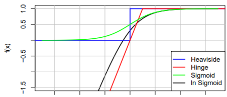

# Newton会
## lightFMのBPR系の損失について
## 2020-04-02 / AI室 中江 俊博
---
## Newton会の趣旨
- AI室で立ち上げる勉強会の1つ。
- 感染病を避けるために部屋に閉じこもるのであれば、  
  一緒に論文を読み、技術を高めようという趣旨。
- 発表者が興味のあるものであれば、何でも構わない。
  - 特に準備がなくてもよいし、思い付きで話してもよい。
  - 誰かに強制もしないし、ローテーションもしない。

---
## 参考 : wikipediaより
- アイザック・ニュートン
  - ロンドンではペストが大流行しており...、  
    この影響でケンブリッジ大学も閉鎖されることになり、
  - 故郷のウールスソープへと戻り、カレッジですでに得ていた  
    着想について自由に思考する時間を得た。
  - 「ニュートンの三大業績」とされるものは、いずれもペスト禍を逃れて  
    故郷の田舎に戻っていた18か月間の休暇中になしとげたこと


---
## 本日の話題
- LightFMにおけるBPR系の損失について
- LightFM ([github](https://github.com/lyst/lightfm)) とは
  - Factorization Machines の実装の一つ
- 例

``` python
# Load the MovieLens 100k dataset. Only five
# star ratings are treated as positive.
data = fetch_movielens(min_rating=5.0)

# Instantiate and train the model
model = LightFM(loss='warp')
model.fit(data['train'], epochs=30, num_threads=2)

# Evaluate the trained model
test_precision = precision_at_k(model, data['test'], k=5).mean()
```

---
## Factorization Machinesとは
- 行列分解
  - ユーザ $i$ のアイテム $j$ に対する応答を  
    特徴ベクトル $\boldsymbol{u}_i$ と $\boldsymbol{v}_j$ の内積に分解する
    - $ y_{ij} = \boldsymbol{u}^T_i \boldsymbol{v}_j $
- Factorization Machines (FM)
  - ユーザ・アイテムすべての属性 $i$ をまとめて ${x_i}$ としたとき  
    - $ y = c + \sum_i w_i x_i + \sum_{ij} (\boldsymbol{u}^T_i \boldsymbol{u}_j) x_i x_j $
      - $c$ は定数項
      - $w_i$ は、属性$i$のバイアス項
      - $\boldsymbol{u}_i$ は、属性$i$の特徴ベクトル
- レコメンド精度は行列分解よりFMのほうが高い傾向がある
  - ただし今日の話題の本題ではない。以下、行列分解の前提で考える。

---
## レコメンドデータの種別
- 測定情報の分類
  - explicit feedback
    - ユーザごとのアイテムへの「好み」がすべて得られる場合
    - 例 : すべての映画に対して、好きか嫌いか5段階でランク付けた結果
  - implicit feedback
    - ユーザごとにアイテムに**興味がある場合にのみ**結果が得られる場合
    - 例 : クリック履歴、購入履歴、応募履歴..
      - AI室が扱うレスポンスのほとんどがimplicitである。
- implicit feedback の取り扱い
  - 1. 反応がなかったアイテムをすべて負例(興味なし)として考える
    - 問題 : 負例が膨大になる
  - 2. 反応がなかったアイテムをサンプリングして負例とする
    - negative samplingと呼ばれる

---
## BPR
- BPR: Bayesian Personalized Ranking from Implicit Feedback  
  - [Rendle+ ; 1205.2618](https://arxiv.org/abs/1205.2618)
- 前提
  - ユーザ $i$ は特徴ベクトルの内積 $\boldsymbol{u}^T_i \boldsymbol{v}_j$ が  
    (正に)大きいアイテム $j$ ほど興味がある。
  - ユーザ $i$ が興味のあるアイテム $j$ しかわからない (implicit feedback)
- BPRのロジック : 次の繰り返し
  - ユーザ $i$ をサンプリングして
    - ユーザが反応したアイテム $j$ を1つサンプリング
    - ユーザが反応しなかったアイテム $k$を1つサンプリング
    - 内積の差 $ x_{i,j,k} = \boldsymbol{u}^T_i \boldsymbol{v}_j - \boldsymbol{u}^T_i \boldsymbol{v}_k$ が  
      大きくなるようにパラメータ更新

---
### BPRのパラメータ更新式 (1/2)
- 内積の差 $x_{i,j,k}$ が大きいとは？
  - ユーザ$i$は、負例$k$よりも、正例$j$のほうが興味がある状態。
  - 本来、観測データから計算した内積の差は大きいはずだ。
- 内積の差 $x_{i,j,k}$ は次の確率 $P(x_{i,j,k}) = \sigma(x_{i,j,k})$ に従うとする

$$
\sigma(x) = \frac1{1 + \exp(-x)}
$$



---
### BPRのパラメータ更新式 (2/2)
- 特徴ベクトルの組 $\Theta$ に基づいて、観測値 $D$ が決まるとする
- $D$ が観測された後のパラメータ $\Theta$ の事後確率は

$$
P(\Theta|D) \propto P(D|\Theta) P(\Theta) = \prod_{i,j,k} P(x_{i,j,k}|\Theta) P(\Theta)
$$

$$ 
\log P(\Theta|D) = \sum_{i,j,k} \log \sigma(x_{i,j,k}) + \log P(\Theta)
$$

$$
\frac{\partial \log P(\Theta|D)}{\partial \Theta} =
  \sum_{i,j,k} \frac{e^{-x_{i,j,k}}}{1 + e^{-x_{i,j,k}}}
  \frac{\partial x_{i,j,k}}{\partial \Theta} - \lambda \Theta
$$
- 最後の式を用いて SGD で更新する。

---
### WARP
- WARPは次の論文で提唱されたBPRの改良
  - WSABIE: Scaling Up To Large Vocabulary Image Annotation  
    ([Weston+ ; IJCAI2011](http://www.thespermwhale.com/jaseweston/papers/wsabie-ijcai.pdf))
- BPRに対して次の点を改良した手法に対応する
  - No.1 : 損失関数をシグモイドではなく、ヒンジにする
  - No.2 : 負例の中での順位も使う

---
### WARP 改良点 No.1
- 損失関数をシグモイドではなく、ヒンジにする
  - 内積の差は $x_{i,j,k}$ が負になってはいけない
  - ヒンジ損失を採用し、内積の差が負の場合のみを更新する
    - $|...|^{+}$は負の場合ゼロとなる関数
    - 差が正となる場合でも、1未満は更新対象とする (マージン)

$$
\textrm{Loss}_{i,j,k} = |1 - \boldsymbol{u}^T_i \boldsymbol{v}_j + \boldsymbol{u}^T_i \boldsymbol{v}_k|^{+}
$$

---
### WARP 改良点 No.2
- 負例の中での正例の順序を使う
  - 負例 $k_1, k_2, ...$ の内積 $\boldsymbol{u}^T_i \boldsymbol{v}_k$ を降順に並べたときに  
    正例$i$ の内積 $\boldsymbol{u}^T_i \boldsymbol{v}_j$ が、**負例の先頭から何番目に入るかの順序** $\textrm{Rank}_i$ を使う
  - あまりに先頭から後ろになっちゃっている残念な正例は  
    更新重みを大きくして、大きめに救う。
- 改良した損失
  - $ L(\textrm{Rank}_i) \times |1 - \boldsymbol{u}^T_i \boldsymbol{v}_j + \boldsymbol{u}^T_i \boldsymbol{v}_k|^{+}$
- 補足
  - どうやって $\textrm{Rank}$ を計算するか？
    - サンプリングでごまかす！
  - $L(...)$ は「単調な関数を使う」とあるが、簡易には線形な関数を使うようだ
    - lightFMの実装を見ないと...

---
### WARP アルゴリズム
- 実施手順
  - ユーザ $i$ をサンプリングして
    - ユーザが反応したアイテム $j$ を1つサンプリング
    - 負例カウントクリア $N=0$
    - 次の繰り返し
      - ユーザが反応しなかったアイテム $k$を1つサンプリング
      - $|1 - \boldsymbol{u}^T_i \boldsymbol{v}_j + \boldsymbol{u}^T_i \boldsymbol{v}_k|^{+} > 0$ ならループ脱出
    - 損失を $L(\frac{M}{N}) |1 - \boldsymbol{u}^T_i \boldsymbol{v}_j + \boldsymbol{u}^T_i \boldsymbol{v}_k|^{+}$ としてSGD更新  
      ここで $M$ は負例全体のサンプル数
- 何をやっている？
  - $\frac{M}{N}$ は $N$回目でヒンジ損失が正となる負例を見つけた場合の、  
    正例の順序 $\textrm{Rank}_i$ の期待値となっている。
- 補足
  - ループの繰り返しが永遠に続くと、いつまでも更新が終わらないので、  
    ループの上限のどこかで切る必要がある。

---
### lightFMについて
- 損失関数 `loss` として `bpr`, `warp` が用意されている
  - implicit feedback データのみを用意すればいい
  - negative sampling したデータを用意する必要はない。
    - BPR, WARPのロジックの中に sampling が入っている
- implicit feedback データは sparse matrix で与えればよい
  - 行(user), 列(item)に対応するfeatureは、別引数で与えられる

``` python
model.fit(train,
          user_features=user_features,
          item_features=item_features,
          epochs=20)
predictions = model.predict(test_user_ids,
                            test_item_ids,
                            user_features=user_features,
                            item_features=item_features)
```

---
### 参考資料
- lightFM
  - https://github.com/lyst/lightfm
- Learning to Rank Sketchfab Models with LightFM
  - BPR,Warpを使ったレコメンドモデル学習について
  - https://www.ethanrosenthal.com/2016/11/07/implicit-mf-part-2/
- BPR: Bayesian Personalized Ranking from Implicit Feedback
  - https://arxiv.org/abs/1205.2618
- WSABIE: Scaling Up To Large Vocabulary Image Annotation (Warpの原論文)
  - http://www.thespermwhale.com/jaseweston/papers/wsabie-ijcai.pdf
