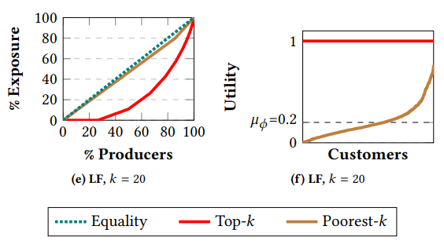

# Newton会
## FairRec
## 2020-05-08 / AI室 中江 俊博
---
## FairRec
- 本日紹介する文献
  - Patro+ (WWW2020, [arxiv:2002.10764](https://arxiv.org/abs/2002.10764))  
    FairRec: Two-Sided Fairness for Personalized Recommendations in Two-Sied Platforms
- ざっくりいうと
  - レコメンドにおいてすべてのアイテムに最小レコメンド回数を保証
  - 同時にユーザ側についても不公平が生じない

---
## WWW2020
- 2020/04/20～24で開催([公式ページ](https://www2020.thewebconf.org/))
  - すべてオンラインで実施。
  - [Research Track 一覧](https://www2020.citi.sinica.edu.tw/schedule/research_track/), 現在論文はすべて[ACMからダウンロードできる](https://dl.acm.org/doi/proceedings/10.1145/3366423)
  - [チュートリアルも多数](https://www2020.thewebconf.org/program#tutorials), 動画も多い
- かなり数が多いので死にそう。

---
## 無制約レコメンドの課題
- レコメンドされるアイテムが特定のアイテムに偏る
- バランスをとる方法
  - ユーザ側が自分の好きなアイテムを取りすぎない
    - 全員が一番嫌いなアイテムを配れば達成可能だが、誰も納得しない。
  - アイテム側が自分のアイテムを配りすぎない
    - 難しい..
- lastFMの例

---
## 公平な割り当てとは？
- 次の両方が成り立つことが望ましい
  - ユーザ側 : envi-freeness (無羨望性)
    - どのユーザも自分の好きなアイテムを取りすぎないといっても、  
      自分よりいいアイテムを割り当てられた他のユーザを妬まない状態。
  - アイテム側 : Proportional Fair Share
    - ユーザに割り当て可能なすべてのアイテム数を  
      全種類で均等割した数だけ、どのアイテムも割り当てられている状態。
      - 100アイテムを100ユーザに10個ずつレコメンドするなら  
        どのアイテムも10回はレコメンドされている状態。

---
## 定式化
- 前提
  - 割り当て$\mathcal{A}$ とは離散的で共有不可なアイテム $\mathcal{P}$ のユーザ $u \in \mathcal{U}$ への配分
    - $\mathcal{A} =  \\{ (A_u) _{u \in \mathcal{U}} : A_u \subseteq \mathcal{P} \\}$
  - それぞれのユーザ $u \in \mathcal{U}$ はアイテムに対する価値関数 $V_u$ を持つ
    - 価値観数は各アイテムの価値の和であるとする。
- 公平性
  - ユーザ側
    - どのユーザも、ほかのユーザの割り当てを妬まない  
      (無羨望性 ; envi-freeness)
      - $\forall u, \forall w \in U, \quad V_u(A_u) \ge V_u(A_w)$
  - アイテム側
    - 割り当ての結果、各アイテムの割り当て数が最小数以上となる。

---
## 具体例

|ユーザ|Item 1|Item 2|Item 3|Item 4|
|--|--:|--:|--:|--:|
|User A|10|9|2|1|
|User B|9|4|6|7|
|User C|10|5|8|3|
|User D|8|7|6|5|

- 各ユーザに2アイテムをレコメンドしよう。
- どのユーザも好みの和を最大化したい。

---
## ユーザ最良割り当て

|ユーザ|Item 1|Item 2|Item 3|Item 4|
|--|--:|--:|--:|--:|
|User A|**10**|**9**|2|1|
|User B|**9**|4|6|**7**|
|User C|**10**|5|**8**|3|
|User D|**8**|**7**|6|5|

- これだと Item 1 は 4回レコメンドされる一方  
  Item 3,4は1回しかレコメンドされない。
- ユーザに2アイテムをレコメンドするなら  
  どのアイテムも2回レコメンドすればバランスが取れる。

---
## 最小アイテム割り当て数を満たす(よくない)例

|ユーザ|Item 1|Item 2|Item 3|Item 4|
|--|--:|--:|--:|--:|
|User A|10|9|**2**|**1**|
|User B|9|4|**6**|**7**|
|User C|**10**|**5**|8|3|
|User D|**8**|**7**|6|5|

- Item はすべて 2回レコメンドされている。
- でも **User A は User C, D がうらやましい！**(この割り当てが嫌だ)
  - User A の割り当ての価値は $2+1=3$
  - 一方 User C, D と同じ割り当てであれば $10+9=19$
    - User C にとってはベストな割り当てではないことに注意。
- これは envi-freeness を満たさない例である。

---
## envi-freeness は実現可能か？

- 極端な例
  - 各ユーザに1アイテムをレコメンドする。
  - アイテムは1回までレコメンドできる。

|ユーザ|Item 1|
|--|--:|
|User A|10|
|User B|8|

- どう割り当てても、他のユーザがうらやましい。envi-freeness は実現不可。
  - アイテムの離散性が問題。本当ならItem 1 を0.5回ずつレコメンドできれば解決。
  - **相手からどの1アイテムを抜いても、まだうらやましいかどうかを議論しよう。**

---
## レコメンドと離散性に注意した定式化
- ユーザ側の公平性
  - 離散アイテムではどう頑張っても envi-freeness は達成できないことがある。
  - 他のユーザの1アイテムを除いた envi-freeness を考える  
    (envi-freeness up to one item ; **EF1**)
    - $\forall u, \forall w \in U, \quad \exists p \in A_w \quad s.t. \quad V_u(A_u) \ge V_u(A_w \setminus \\{ p \\} )$
- アイテム側の公平性
  - 各ユーザに $k$ アイテムをレコメンドする前提では  
    $\lfloor \frac{k|U|}{|P|} \rfloor$ 個以上を割り当てるのが公平
    (Maximum Share guarantee ; **MMS**)
    - 10アイテムを100ユーザに5レコメンドだと、  
      1アイテム当たり50回レコメンドを目指す

---
## 最小アイテム割り当て数を満たす(よくない)例 : Recap

|ユーザ|Item 1|Item 2|Item 3|Item 4|
|--|--:|--:|--:|--:|
|User A|10|9|**2**|**1**|
|User B|9|4|**6**|**7**|
|User C|**10**|**5**|8|3|
|User D|**8**|**7**|6|5|

- User A は User C, D がうらやましい
- 仮に User C, D に割り当てた Item 1, 2 のどちらを除外しても User A の価値で評価すると、  
  User A は User C, D がまだうらやましい。
  - 現在の User A の割り当ての価値 : $2+1=3$
  - Item1 の価値 $10>3$, Item2 の価値 $9>3$
- EF1 はこのケースでは成り立っていない。

---
## バランスが取れた例
|ユーザ|Item 1|Item 2|Item 3|Item 4|
|--|--:|--:|--:|--:|
|User A|**10**|**9**|2|1|
|User B|**9**|4|6|**7**|
|User C|10|5|**8**|**3**|
|User D|8|**7**|**6**|5|

- どのアイテムも 2回以上お薦め (MMS以上の条件を満たす)
- でも例えば User C は User A がうらやましいのでは？
  - User A の Item 1, 2 のいずれも自分の価値に当てはめると、  
    どちらの価値(10, 5)も,自分の持っている Item 3, 4 の和 (11) より小さい
- EF1 が成立している例となっている
  - 実は、今回紹介する FairRec で作った例！

---
## FairRec
- 一言でいうと、ユーザに(ランダムに)順番をきめて  
  順番にそのユーザが好きなアイテムをとってもらう。 
  - Greedy-Round-Robin
- ただし、どのアイテムも $\displaystyle l = \lfloor \frac{m k}{n} \rfloor$ だけコピーを作り  
  それ以上のレコメンドはできないとする。
  - $k$ ... ユーザ当たりレコメンドアイテム数
  - $m, n$ ... ユーザ数、アイテム数

---
## FairRecの進め方
- 次の2フェーズで回す
  - **Phase1** : 在庫 $\displaystyle l = \lfloor \frac{m k}{n} \rfloor$ でアイテムが取れなくなるまで Greedy-Round-Robin
  - **Phase2** : 在庫無限で全員に $k$ アイテム行き渡るまで Greedy-Round-Robin
- アイテムが取れなくなるケース
  - 在庫がゼロになるケース。
    - 例えば 8アイテムを 10ユーザ 3アイテムレコメンドする場合など
    - $l=3$ となるが、最後の3アイテム目のレコメンドで在庫足りなくなる。
  - 選ぼうとしているユーザが持っているアイテムの在庫はあるが  
    持っていないアイテムの在庫が尽きたケース。
